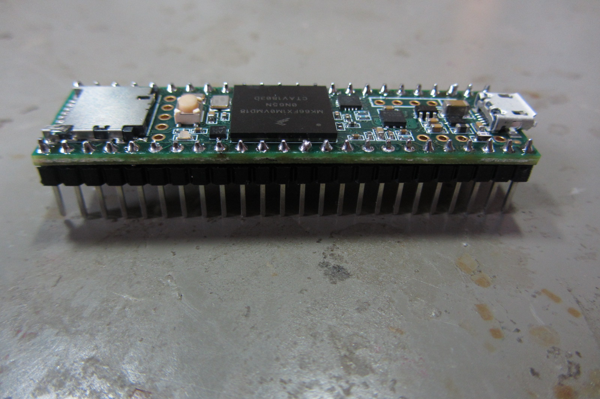
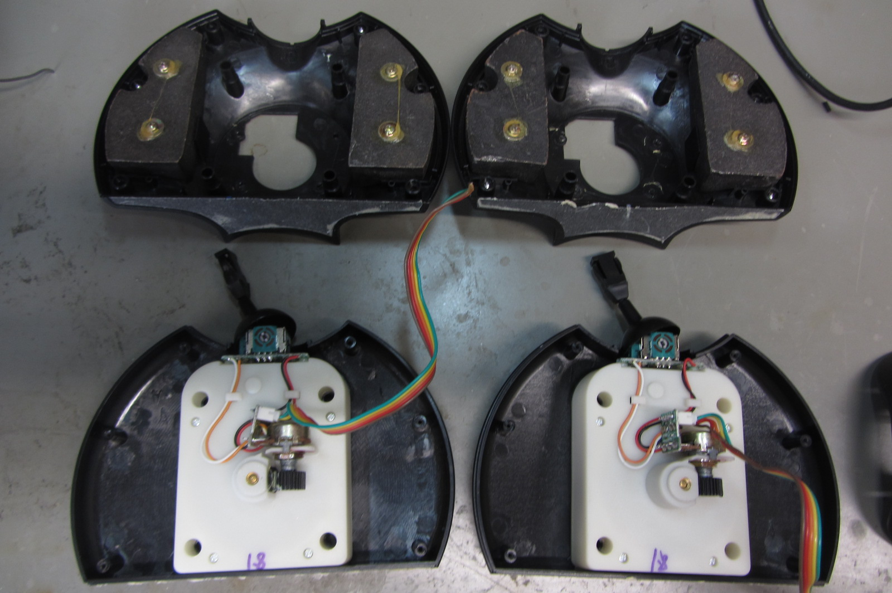
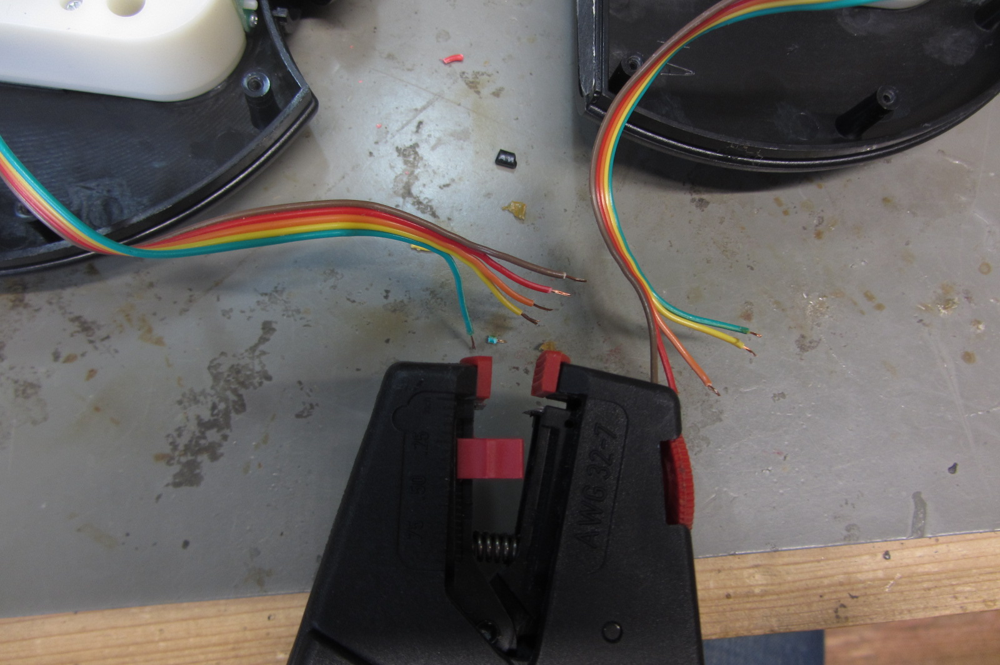
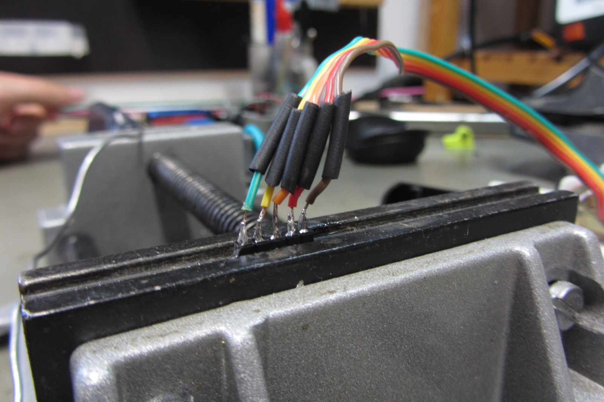
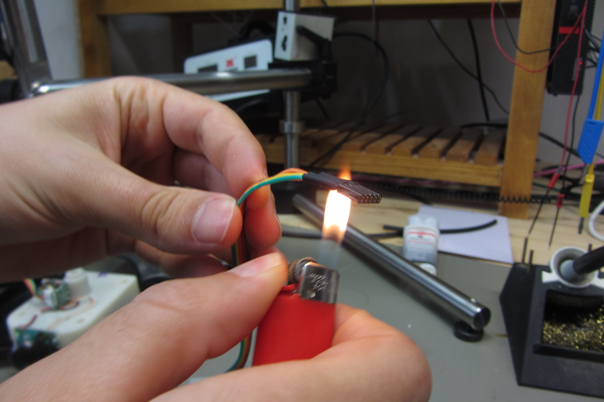
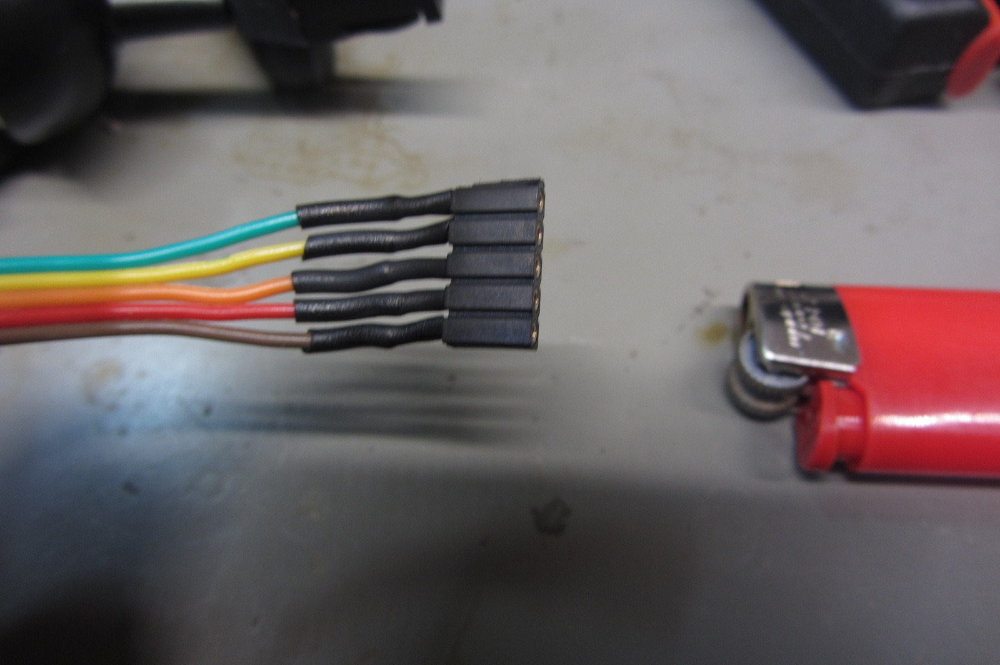
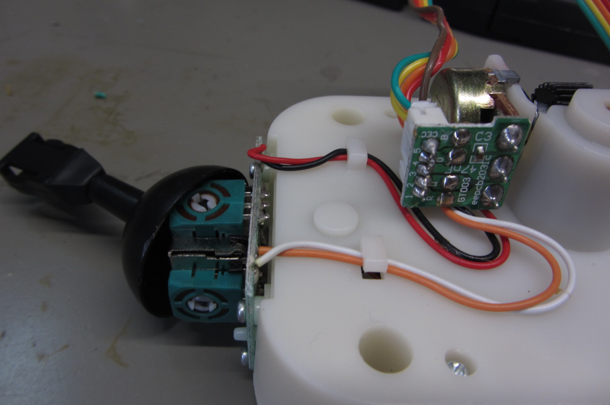
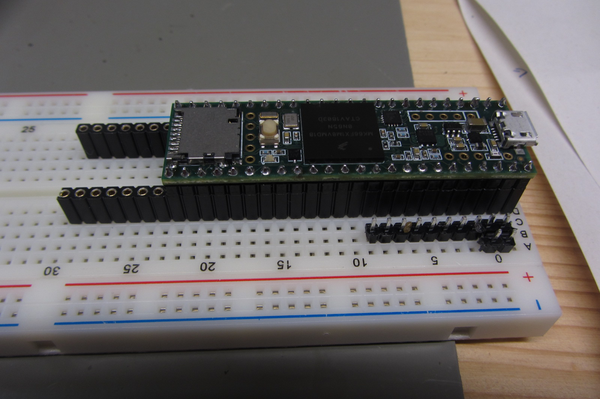
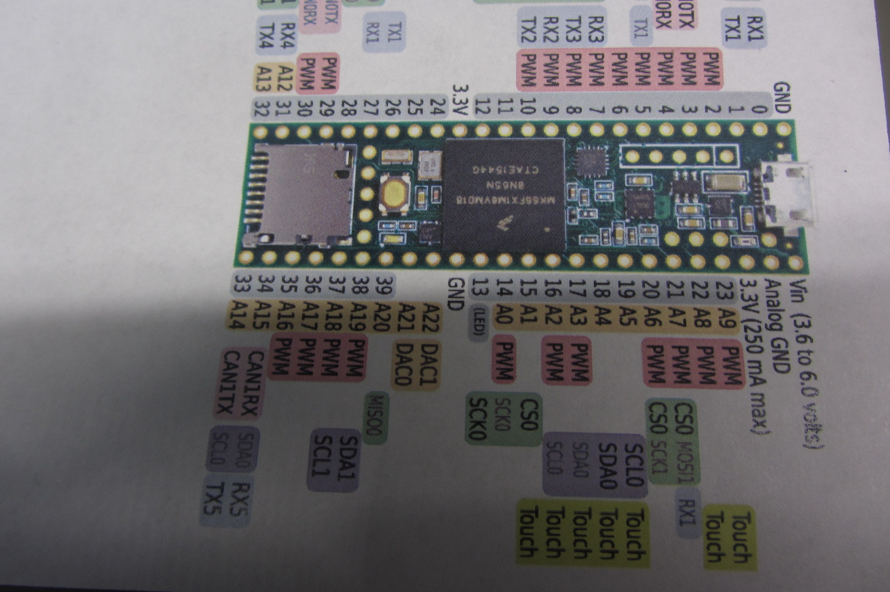

# Gamtrak Nr 2 

## Vom Golf-Playstation-controller zum Midicontroller

### Einkaufsliste:                                     

Item                                       | Preis (EUR)
-------------------------------------------|:-------:
Gamtrak version 2                          | 20 
Experimentierboard                         | 7
Teensy 3.6                                 | 34 
Pins männlich und weiblich, je 2 Leisten   | 5
Kabel                                      | 3
Schrumpfschlauch

### Equipment:

* Lötkolben
* Lötzinn
* Abisolierzange
* Zange
* Schraubenzieher
* Feuerzeug
* Multimeter
* USB Kabel & Computer

### Bausession:

Start 19:00 Ende 21:15

Der Teensy wurde ohne Pins geliefert, deshalb werden als erstes die männlichen Pins so auf das Experimentierboard gesteckt, dass man den Teensy auf die Pins stecken kann und nun
die ersten 4 äußeren Pins an den Teensy löten kann. 
Dann den Teensy mit den Pins orgentlich einspannen und alle 
* männliche Pins an den Teensy löten

(Teensy ohne Pins, Experimetierboard mit männlichen Pins)

(Lötkolben und Teensy mit männlichen Pins angelötet)

(alle Pins sind sauber am Teensy angelötet, auch unter der Lupe sind keine falschen Brücken)

* Gamtrak aufschrauben

(Gametrak Version 2, noch ganz)

(aufgeschraubt)

* die 5 Kabel, die jeweils aus den beiden Potentiometern (Spule und Schnur vom Gamtrak) kommen, von der Gamtrak eigenen Platine abknipsen

Dann hat man folgende lose Bauteile: Beide Spulen inklusive Schnur und Potentiometer mit Kabeln 

* die 2x 5 abgeknipsten Kabel mit der Abisolierzange an den Enden ca 3mm abisolieren,

* dann jedes Ende mit dem Lötkolben einzeln mit Lötzinn verzinnen

* 10x 1cm Schrumpfschlauchstücke abschneiden, jedes Schrumpfschlauchstück über ein Kabel ziehen

* jedes Kabelende einzeln mit einem Ende eines weiblichen Pins verlöten

* die Schrumpfschlauchstücke über die gelöteten Stellen ziehen, den Schrumpfschlauch mit dem Feuerzeug schrumpfen lassen

* Das Bauteil mit Spule und Potentiometer mit den fertig angelöteten weiblichen Pins sieht dann so aus:

Hier noch das Bauteil Spule und Potentiometer des Gametraks in Nahaufnahme:

* Da die Farbbelegung der Kabel irreführend/ungewöhnlich ist, mit dem Multimeter den Widerstand messen, um herauszufinden, wie die Kabel tatsächlich belegt sind, also welche Kabel mit + - belegt sind, und welche die Sensorenkabel sind.
(Sensorenkabel=Signalleitungen lesen den variablen Widerstand aus den beiden Potentiometern aus, d.h. wie weit die Schnur des Gametraks herausgezogen ist, und in welchem Winkel sie steht.)

* Die Widerstandsmessungen haben folgendes ergeben: Die 5 Kabel, die jeweils mit einem Potentiometer verbunden sind, sind in diesem Gamtrak folgendermaßen belegt: Die beiden äußeren Kabel (hier braun und grün) sind für plus und minus, die 3 inneren Kabel (hier rot, orange,gelb) sind die Signalleitungen. 

* Nun den Teensy mit den angelöteten männlichen Pins in die weibliche Pins stecken und damit ins Experimentierboard stecken, daneben noch extra männliche Pins stecken, um die Kabel vom Teensy zum Board zu verbinden. (Dafür sich vorher den Schaltplan anschauen,wie man am besten die Siglalleitungen und die Plus und Minus Kabel legen möchte.)

In diesem Fall wird der Analog GND (GND= Ground = Minus) mit 2 männlichen Steckern auf dem Board verdoppelt, sowie auch das Plus (hier 3.3V) mit 2 Steckern auf dem Board verdoppelt wird.
Um die Sensorenkabel zu verbinden werden hier die Belegungen der Analogpins 16=A2, 17=A3 und 18=A4 für die erste Spule mit Potentiometer gewählt, und die Belegungen 20=A6, 21=A7 und 22=A8. 
Natürlich können die Belegungen auch anders gewählt werden, in diesem Fall ist die Belegung aber schön kompakt und man braucht relativ wenige Kabel löten. 

Hier nochmal der ganze Teensy Schaltplan:

* die Kabel vom Potentiometer im Experimentierboard mit dem Teensy verbinden: Jeweils die Plus und Minus Kabel mit dem GND und 3.3 V vom Teensy durch stecken verbinden, und die jeweils 3 Sensorenkabel mit jeweils 3 Analoge-Pins vom Teensy durch stecken verbinden. (Z.B. A0-A6, Nr 14-20 am Teensy).

(Diese gesteckte Version kann später natürlich gelötet werden oder durch stabiliere Stecksystheme ersetzt werden)

Jetzt nur noch mit dem Computer verbinden und schauen ob es schon funktioniert,
das heißt:
* mit dem USB Kabel den Teensy mit dem Computer verbinden und entweder einen beliebigen Open-Source Synthesizer starten (z.B. Helm), oder
* in der Software (die extra dafür geschreiben wurde- siehe scr Ordner) die neuen Belegungen des Teensy eintragen, im Arduino Programm im callibration mode die Potentiometer neu kallibrieren

* PurData auf dem Rechner starten und den neuen Gametrak2.0- Midicontroller mit den Patches von Pd testen
* TADAAA es funktioniert, jetzt nur noch eine Box für den Gametrak bauen und viel Spaß mit dem neuen Midicontroller! 
