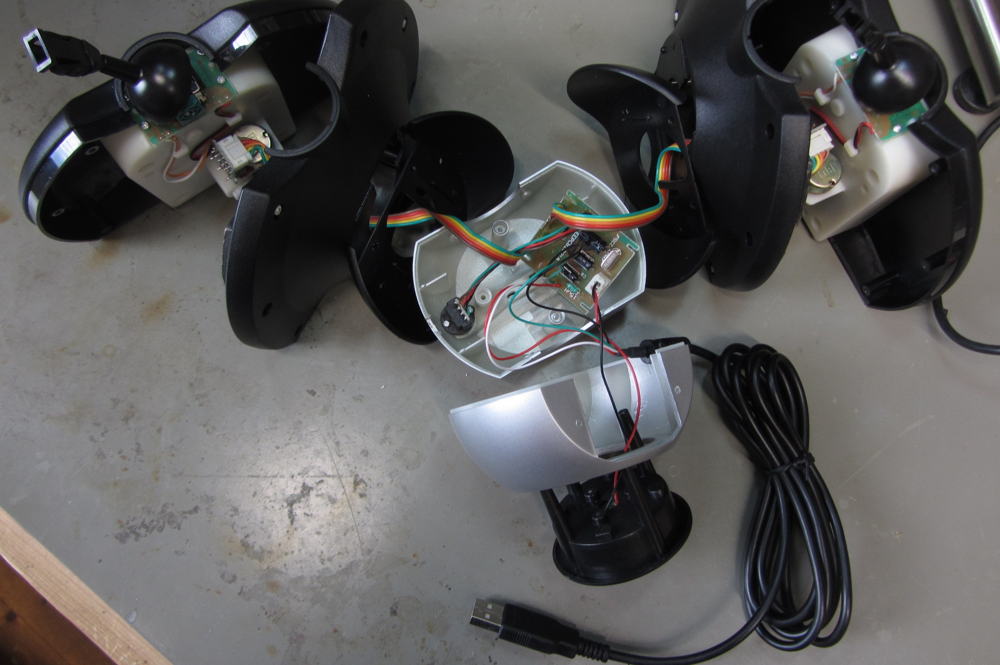
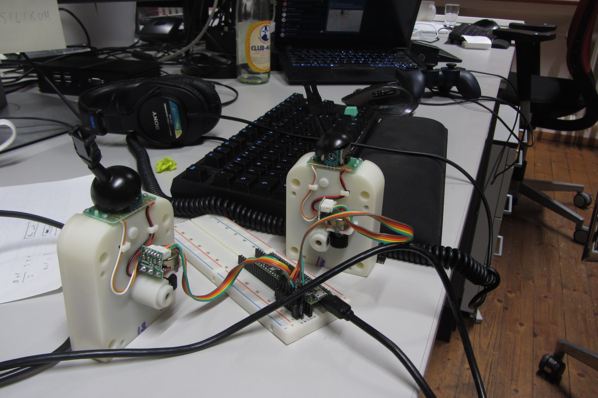

# Gametrak Nr 2 

## Vom Golf-Playstation-controller zum Midicontroller

`TODO: Einleitungstext`  
Der Gametrak ist ein Controller für die Playstation, mit dem man bspw. Golf spielen kann. Aus dem Controller kommen zwei Schnüre aus zwei Spulen heraus, die man ca zwei Meter in die Höhe herausziehen kann, und die man schön durch Bewegung dreidimensional im Raum steuern kann, und zwar auf den Achsen vor-zurück, rechts-links und nach oben und unten.  
Dieser Gametrak-Controller wird nicht mehr hergestellt, ist aber zurzeit erschwinglich bei ebay & co. zu haben. (Stand 2019)   
Da dieser Controller so schön ganzkörperlich zu bedienen ist, eignet er sich auch als etwas ausgefallener Midi-controller.  

Dieser Text ist eine Art Bauanleitung, wie man einen Gametrak selbst in einen Midicontroller umbauen kann. 
Den Gametrak gibt es in verschiedenen Ausührungen: Hier im Video ist eine kleine Performance mit einer älteren Gametrak Version zu sehen, bei der der Gametrak als Controller noch als urspüngliche Box (nur ohne Deckel) erhalten ist.

https://raw.githubusercontent.com/anoujeremia/gametrak/master/images/Gametrak%20Preview.png

**Die folgende Bauanleitung** beschreibt den Umbau von einer neueren (Gametrak 2) Variante, bei dem man am Ende dann nur die Spuelenbauteile mit den Schnüren aus dem Gametrak heraus nimmt und dann eine andere Box dazu bauen muss, da für zusätzliche Teile in der Gametrak 2 Version kein Platz ist.

### Einkaufsliste:                                     

Item                                       | Preis (EUR)
-------------------------------------------|:-------:
Gametrak version 2                          | 20 - 30
Experimentierboard                         | 7
Teensy 3.6                                 | 34 
Pins männlich und weiblich, je 2 Leisten   | 5
Kabel                                      | 3
Schrumpfschlauch                           | 0,10             

### Equipment:

* Lötkolben
* Lötzinn
* Platinenhalter/Schraubstock
* Abisolierzange
* Zange
* Schraubenzieher
* Feuerzeug
* Multimeter
* USB Kabel & Computer

### Bausession:

Start 19:00 Ende 21:15

Der Teensy wurde ohne Pins geliefert, deshalb werden als erstes die männlichen Pins so auf das Experimentierboard gesteckt, dass man den Teensy auf die Pins stecken kann und nun
die ersten 4 äußeren Pins an den Teensy löten kann. 
Dann den Teensy mit den Pins orgentlich einspannen und alle 

männliche Pins an den Teensy löten | _
-----------------------------------|---
Teensy ohne Pins, Experimetierboard mit männlichen Pins | 
Lötkolben und Teensy mit männlichen Pins angelötet | 
Alle Pins sind sauber am Teensy angelötet, auch unter der Lupe sind keine falschen Brücken. | 
**Gamtrak außeinander nehmen** | 
Gametrak Version 2, noch ganz | 
aufgeschraubt | 
Die 5 Kabel, die jeweils aus den beiden Potentiometern (Spule und Schnur vom Gamtrak) kommen, von der Gamtrak eigenen Platine abknipsen | 
dann hat man folgende lose Bauteile: Beide Spulen inklusive Schnur und Potentiometer mit Kabeln. | 
**Neue weibliche Verbinder anlöten** | 
Die 2x 5 abgeknipsten Kabel mit der Abisolierzange an den Enden ca 3mm abisolieren, | 
dann jedes Ende mit dem Lötkolben einzeln mit Lötzinn verzinnen und 10x1cm Schrumpfschlauchstücke abschneiden, jedes Schrumpfschlauchstück über ein Kabel ziehen | 
jedes Kabelende einzeln mit einem Ende eines weiblichen Pins verlöten | 
die Schrumpfschlauchstücke über die gelöteten Stellen ziehen, |  
den Schrumpfschlauch mit dem Feuerzeug schrumpfen lassen | 
fertig! | 
Das Bauteil mit Spule und Potentiometer mit den fertig angelöteten weiblichen Pin | 
Das Bauteil Spule und Potentiometer des Gametraks in Nahaufnahme | 
* Da die Farbbelegung der Kabel irreführend/ungewöhnlich ist, mit dem Multimeter den Widerstand messen, um herauszufinden, wie die Kabel tatsächlich belegt sind, also welche Kabel mit + - belegt sind, und welche die Sensorenkabel sind.
(Sensorenkabel=Signalleitungen lesen den variablen Widerstand aus den beiden Potentiometern aus, d.h. wie weit die Schnur des Gametraks herausgezogen ist, und in welchem Winkel sie steht.)
`TODO: für den Laien vielleicht schwer nachzuvollziehen.`

* Die Widerstandsmessungen haben folgendes ergeben: Die 5 Kabel, sind in diesem Gamtrak folgendermaßen belegt: Die beiden äußeren Kabel (hier braun und grün) sind für plus und minus, die 3 inneren Kabel (hier rot, orange,gelb) sind die Signalleitungen der drei Potis. 

* Nun den Teensy mit den angelöteten männlichen Pins in die weiblichen Pins -- und dadurch ins Experimentierboard -- stecken, daneben noch extra männliche Pins stecken, um die Kabel vom Teensy zum Board zu verbinden. (Dafür sich vorher den Pinbelegungsplan anschauen, wie man am besten die Siglalleitungen und die Plus und Minus Kabel legen möchte.)

Teensy auf dem Experimentierboard | Pinbelegungen des Teensy
----------------------------------|-------------------------
    | 

In diesem Fall wird der Analog GND (GND= Ground = Minus) mit 2 männlichen Steckern auf dem Board verdoppelt, sowie auch das Plus (hier 3.3V) mit 2 Steckern auf dem Board verdoppelt wird.
Um die Sensorenkabel zu verbinden werden hier die Belegungen der Analogpins 16=A2, 17=A3 und 18=A4 für die erste Spule mit Potentiometer gewählt, und die Belegungen 20=A6, 21=A7 und 22=A8. 
Natürlich können die Belegungen auch anders gewählt werden, in diesem Fall ist die Belegung aber schön kompakt und man muss relativ wenige Kabel löten.

* die Kabel vom Potentiometer im Experimentierboard mit dem Teensy verbinden: Jeweils die Plus und Minus Kabel mit dem GND und 3.3 V vom Teensy durch Stecken verbinden, und die jeweils 3 Sensorenkabel mit jeweils 3 Analoge-Pins vom Teensy durch Stecken verbinden. (Z.B. A0-A6, Nr 14-20 am Teensy).

Verbindung zwischen Potis und Teensy | _
-------------------------------------|---
Die erste Hälfte des Gametraks ist verbunden. Links die drei Sensor-Leitungen (gelb, orange, rot) und rechts die beiden Pole (braun = -, grün = +).| 
Die zweite Hälfte ist verbunden. Diese gesteckte Version kann später natürlich gelötet werden oder durch stabilere Stecksysteme ersetzt werden. | 
Gesamtansicht von Teensy und den beiden Gametrak-Hälften. | .

Jetzt nur noch mit dem Computer verbinden und schauen ob es schon funktioniert,
das heißt:
* mit dem USB Kabel den Teensy mit dem Computer verbinden und entweder einen beliebigen Open-Source Synthesizer starten (z.B. [Helm](https://tytel.org/helm/)),
* oder in der Software (die extra dafür geschreiben wurde- siehe [TeensySourcecode](./TeensySourcecode/) Ordner) die neuen Belegungen des Teensy eintragen, im Arduino Programm im callibration mode die Potentiometer neu kallibrieren `TODO: den Schritt müssen wir detaillierter erklären`
* PureData auf dem Rechner starten und den neuen Gametrak2.0- Midicontroller mit den Patches von PureData testen
* TADAAA es funktioniert, jetzt nur noch eine Box für den Gametrak bauen und viel Spaß mit dem neuen Midicontroller!

